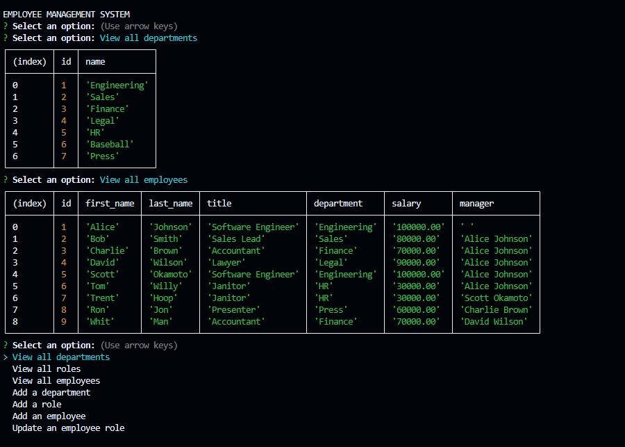

# Employee Management System
-[Link to GitHub repository](https://github.com/swokamoto/Employee-Management)
-[Link to video Demo](https://youtu.be/xBpo5_lBi40)
## Table of Contents

- [Employee Management System](#employee-management-system)
  - [Table of Contents](#table-of-contents)
  - [Description](#description)
  - [Installation](#installation)
  - [Usage](#usage)
  - [Contributing](#contributing)
  - [Questions](#questions)
## Description
This is an Employee Management System. In the command-line, you will be prompted with several choices. You can view Employees, Roles, and Departments, as well as add new entries into each category. There is also the choice to update an employee's Role. This management system will store your information into a PostgreSQL database.  

## Installation
First run `npm install` to get the required packages. Then ensure your database is created by running the schema.sql file. Initial data can be entered using seeds.sql. Please ensure your login credentials are correct.
## Usage
To start the application, enter `npm start`. Then follow the prompts.
## Contributing
Please follow the [Contributor Covenant](https://www.contributor-covenant.org/) guidelines.
## Questions
If you have any questions, please reach out to me at swokamoto@gmail.com. 
